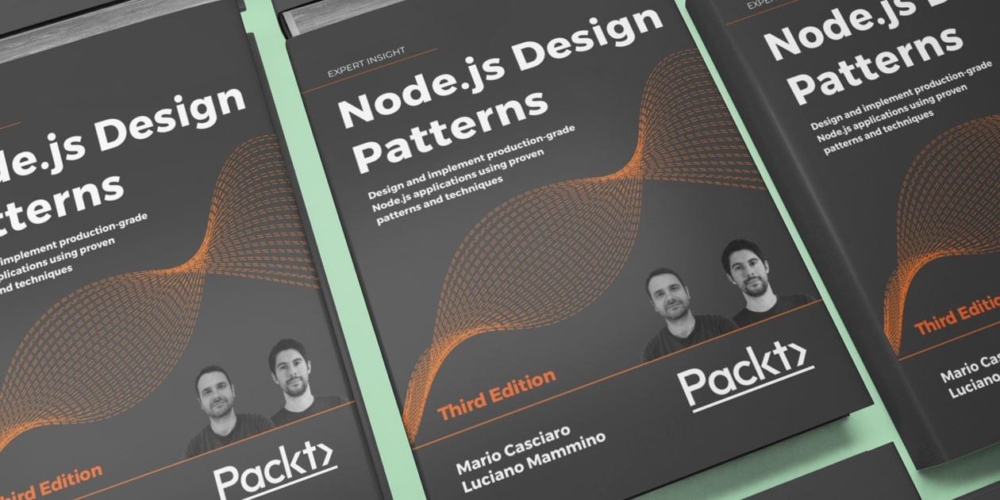

# nodejsdesignpatterns.com


The website source code for possibly the [Best Node.js book](https://www.nodejsdesignpatterns.com/) out there: Node.js Design Patterns 😊

[](https://www.nodejsdesignpatterns.com/)


## Dependencies

Install dependencies with

```bash
npm install
```


## Run

Run the local development server (with auto-reload):

```bash
npm run dev
```

Run the build with:

```bash
npm run build
```