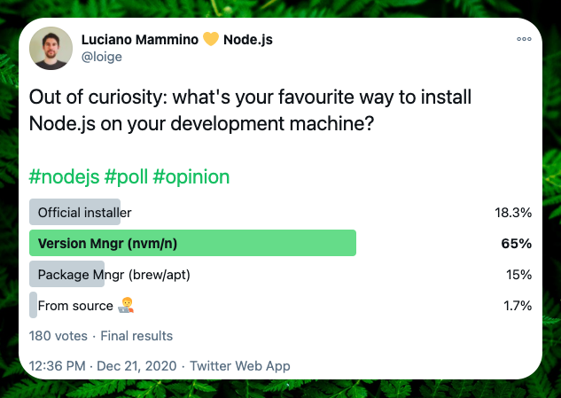
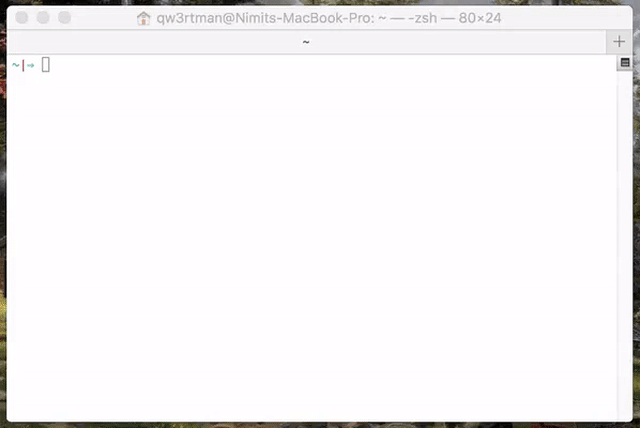
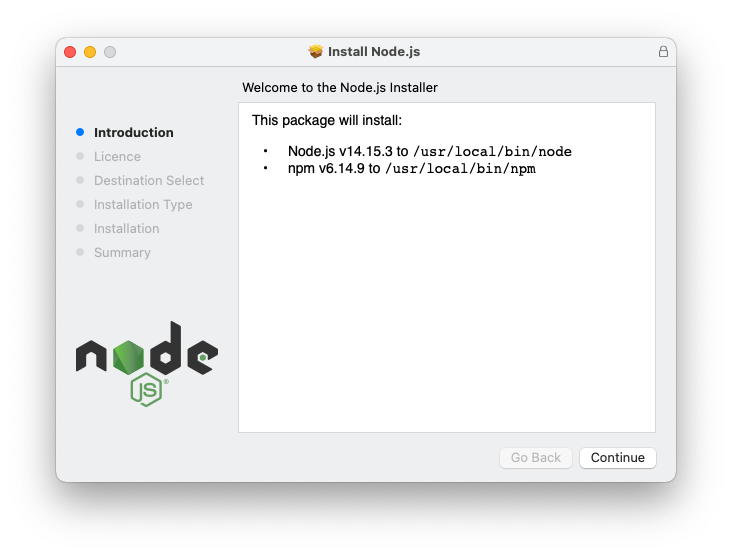
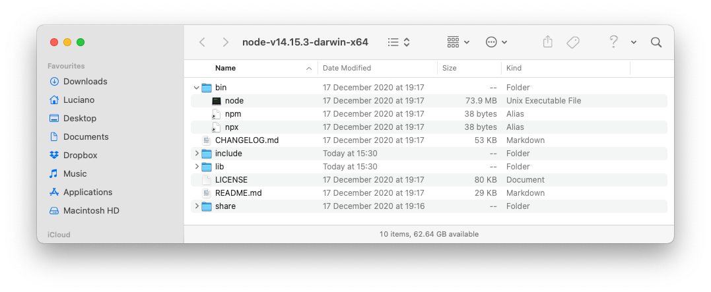
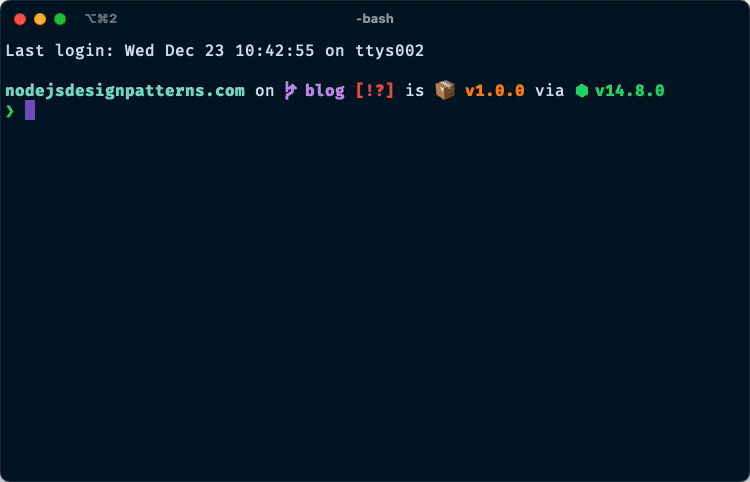

In this article, we will explore the most common ways to install Node.js in your development system. We will cover modern version managers like `fnm`, `nvm`, `Volta`, and `n`, the official installer for various platforms, how to use Docker for Node.js development, and how to compile Node.js from source. Along the way, we will share tips to help you choose the right approach and get productive with Node.js!

Let's get started!

## Which option should I pick?

There are many different ways to install Node.js and every one of them comes with its own perks and drawbacks. In this article, we will try to explore the most common ones and by the end of it, you should have a good understanding of which ones should be more suitable for you.

### TLDR;

- Use a version manager like `fnm`, `nvm`, `Volta`, or `n` if you develop with Node.js frequently and you expect to be needing to switch Node.js version while moving from one project to another or to debug potential compatibility issues in your project or library.
- `fnm` is the recommended choice for most developers: it's fast, cross-platform, and easy to use.
- Use the system package manager like `apt`, `brew` or `winget` if you tend to install all your software this way and if you don't expect to be needing to switch or upgrade Node.js version too often.
- Install Node.js from source if you are an advanced user and if you want to contribute back to Node.js itself.
- Use the official Node.js installer if you don't fall in any of the previous options...

### What other people seem to like

Before writing this article, I was actually curious to find out what are the options that most folks in my network prefer. For this reason, I run a [poll on Twitter](https://twitter.com/loige/status/1340999569807712257). In this poll I asked how you prefer to install Node.js and provided 4 options:

- Official Installer
- Version manager (`nvm` or `n`)
- Package Manager (`apt`, `brew`, etc.)
- From source

The results are quite interesting:

[](https://twitter.com/loige/status/1340999569807712257)

It seems quite obvious that people in my network, mostly fellow software engineers, prefer to use version managers such as `nvm` or `n`.

The second place (actually very tight with the third one) is the official installer, followed by a system package manager and, last one, installing Node.js from source.

### LTS and stable releases

Before moving on and exploring all the different installation options, it is definitely worth spending few words to learn about the types of release the Node.js project maintains.

Node.js offers 2 main release lines:

- **Stable** (or _Current_): every new major Node.js release is considered "Current" for the first 6 months after the publish date. The idea is to give library authors the time to test their compatibility with the new release and do any necessary change. After the 6 months period, all the odd release numbers (9, 11, 13, 15, etc.) move to the state of _Unsupported_, while even releases (10, 12, 14, etc.) are promoted to _Long Term Support_ (or "LTS").
- **LTS**: releases marked as "Long Term Support" get critical bug fixes for a total of 30 months since the initial publish date. This makes LTS releases particularly suitable for production deployments. The most recent LTS is also called _Active LTS_, while previous LTS versions (still under the 30 months support timeframe) are called _Maintenance LTS_.

Finally, the release coming from the current _master_ branch is considered **Unstable**. This is generally a release dedicated to people maintaining Node.js or developers who want to explore new experimental features that haven't been yet included in any of the major releases.

Node.js publishes an [official timeline of current and future releases](https://nodejs.org/en/about/releases/). You can always check the current release schedule on the official Node.js website.

If you are still wondering which release should you use, going with the _Active LTS_ is almost always the best choice, especially if you are building production applications. As of 2026, Node.js 22 is the current Active LTS version.

## Install Node.js using n

Since installing Node.js using a version manager seems to be the favourite option (and it's also my personal favourite!) let's start with it.

My favourite Node.js version manager is [`n` by TJ Holowaychuk](https://github.com/tj/n). The reason why I like it is because it is quite simple to install and use and it is generally up to date with the latest releases of Node.js.
The main issue with it is that it does not support Windows, so if Windows is your operative system, this is not an option for you!

Let's see how to install `n`:

If you are on macOS and you have `brew` (Homebrew) installed, the simplest way to install `n` is to just do it with `brew`:

```bash
brew install n
```

Alternatively, you can use the custom install script:

```bash
curl -L https://git.io/n-install | bash
```

**Note:** if you are concerned about running a script downloaded from the web (as you should because [`curl | bash` might be dangerous](https://www.idontplaydarts.com/2016/04/detecting-curl-pipe-bash-server-side/)), you can always download the script first, READ IT, and then run it locally...

If all goes well, you should now be able to use the `n` executable from your shell.

These are some of the commands you can run:

```bash
# shows the version of `n` installed in your system
n --version

# installs the latest LTS release of Node.js
n lts

# lists all the versions of Node.js currently available
n list

# install the given version of Node.js and switch to it
n <some_version>
```

Or you can simply run:

```bash
n
```

For an interactive prompt that will show you all the available versions, highlight the ones you have already installed and let you pick the version you want to switch to.



In summary, this is where `n` shines or falls short:

- 👎 No official support for Windows
- 👍 Very easy to install on macOS and unix systems
- 👍 Very easy to keep your Node.js install up to date and switch version on demand
- 👍 It keeps all the installed versions cached, so you can switch quickly between versions (no full re-install)
- 👍 Allows to keep the setup local to the user so you don't have to use admin permission to install global packages

## Install Node.js using fnm

[`fnm`](https://github.com/Schniz/fnm) (Fast Node Manager) is a modern, cross-platform Node.js version manager written in Rust. It has become increasingly popular due to its speed and simplicity. Unlike `n`, fnm works on Windows, macOS, and Linux.

### Installing fnm

On macOS with Homebrew:

```bash
brew install fnm
```

On Windows with Winget:

```bash
winget install Schniz.fnm
```

On Linux/macOS with the install script:

```bash
curl -fsSL https://fnm.vercel.app/install | bash
```

After installation, you need to set up your shell. Add the following to your shell configuration file (`.bashrc`, `.zshrc`, or equivalent):

```bash
eval "$(fnm env --use-on-cd)"
```

The `--use-on-cd` flag enables automatic version switching when you enter a directory with a `.node-version` or `.nvmrc` file.

### Using fnm

Here are the most common fnm commands:

```bash
# Install the latest LTS version
fnm install --lts

# Install a specific version
fnm install 22

# List installed versions
fnm list

# Use a specific version
fnm use 22

# Set a default version
fnm default 22

# Show current version
fnm current
```

fnm also supports `.node-version` and `.nvmrc` files for per-project version management:

```bash
# Create a .node-version file in your project
echo "22" > .node-version

# fnm will automatically switch to this version when you cd into the directory
# (if you enabled --use-on-cd in your shell setup)
```

### Why fnm is fast

fnm is written in Rust and uses symbolic links instead of modifying your PATH for each version switch. This makes version switching nearly instantaneous, even when you have many versions installed.

Here are the pros and cons of fnm:

- 👍 **Blazingly fast** - written in Rust, version switching is nearly instant
- 👍 **Cross-platform** - native support for Windows, macOS, and Linux
- 👍 **Simple** - easy to install and use with a clean CLI
- 👍 **Compatible** - supports `.nvmrc` files from nvm
- 👍 **Automatic switching** - can automatically switch versions based on project configuration
- 👎 Smaller community compared to nvm (but growing quickly)

## Install Node.js using nvm

With more than 45 thousand stars on GitHub, [`nvm`](https://github.com/nvm-sh/nvm), which stands for "Node.js Version Manager" (no surprises!), is probably the most famous Node.js version manager currently available.

`nvm` works on any POSIX-compliant shell (`sh`, `dash`, `ksh`, `zsh`, `bash`, etc.) and it has been strongly tested against the following systems: unix, macOS, and windows WSL (if you are on Windows, you can also check out [`nvm-windows`](https://github.com/coreybutler/nvm-windows)).

The easiest way to install `nvm` on your system is to use the official installer script:

```bash
curl -o- "https://raw.githubusercontent.com/nvm-sh/nvm/v0.40.1/install.sh" | bash
```

**Note**: Check the [nvm releases page](https://github.com/nvm-sh/nvm/releases) for the latest version available.

Once `nvm` is installed in your system, here are some examples showing what you can do with it:

```bash
# installs the latest version of Node.js
nvm install node

# installs the latest LTS version of Node.js
nvm install --lts

# installs a specific version of Node.js
nvm install "10.10.0"

# switch to a specific version of Node.js
nvm use "8.9.1"

# runs a specific script with a given version of Node.js (no switch)
nvm exec "4.2" node somescript.js

# shows the full path where a given version of Node.js was installed
nvm which "4.2"

# lists all the versions of Node.js available
nvm ls
```

One great thing about `nvm` is that it allows to specify the Node.js version you want to use for a given project.

For instance, if you are working on a project that requires you to use Node.js `10.10` you can do the following (in the root folder of the project):

```bash
echo "10.10" > .nvmrc
```

Then every time you work on that project, you only need to run:

```bash
nvm use
```

Which should print something like this:

```
Found '/path/to/project/.nvmrc' with version <10.10>
Now using node v10.10.1 (npm v6.7.3)
```

At this point, you can be sure that you working using the correct Node.js version for your project.

If you don't want to do manually, you can enable [deeper shell integration](https://github.com/nvm-sh/nvm#deeper-shell-integration) to make this happen automatically when you `cd` into a folder that has a `.nvmrc` file.

**PRO tip**: You can also do that by using [`asdf`](https://asdf-vm.com/), a _meta_ version manager that offers a unified interface for various programming languages and version managers (including Node.js, of course).

Finally, here are some pros and cons of `nvm`:

- 👍 Most popular version manager for Node.js with a large community of users.
- 👍 Very easy to install on POSIX systems.
- 👍 It allows for easy (and even automated) switch of Node.js version based on the project you are working on.
- 👍 It keeps all the installed versions cached, so you can switch quicly between versions (no full re-install)
- 👍 You can run once off commands on a given version of Node.js without having to switch the entire system to that version.
- 👎 You might have to take a bit of time to go through the documentation and make sure you install it and use it correctly.

## Install Node.js using Volta

[Volta](https://volta.sh/) is a JavaScript tool manager that takes a different approach to version management. Instead of manually switching versions, Volta automatically detects and uses the right Node.js version based on your project's configuration.

### Installing Volta

On Unix systems (macOS, Linux):

```bash
curl https://get.volta.sh | bash
```

On Windows, download and run the installer from the [Volta website](https://volta.sh/).

### Using Volta

Volta's key feature is automatic version management through your `package.json`:

```bash
# Install a Node.js version
volta install node@22

# Pin a Node.js version to your project
volta pin node@22
```

The `volta pin` command adds the Node.js version to your `package.json`:

```json
{
  "volta": {
    "node": "22.0.0"
  }
}
```

When anyone with Volta installed enters your project directory, Volta automatically uses the correct Node.js version without any manual intervention.

```bash
# Install npm or yarn globally (Volta manages these too)
volta install npm
volta install yarn

# Pin package manager versions to your project
volta pin npm@10
```

### Why choose Volta

Volta excels at team environments where everyone needs to use the same tool versions:

- 👍 **Zero configuration switching** - automatically uses the right version per project
- 👍 **Team friendly** - versions stored in `package.json`, tracked in git
- 👍 **Fast** - written in Rust, near-instant version switching
- 👍 **Cross-platform** - works on Windows, macOS, and Linux
- 👍 **Manages multiple tools** - handles Node.js, npm, and Yarn versions
- 👎 Less flexibility for ad-hoc version testing compared to nvm/fnm

## Install Node.js using the official installer

The second most common way to install Node.js is through one of the official installers or the pre-compiled binaries.

[Official installers](https://nodejs.org/en/download/) are available on the official Node.js website for Windows and macOS and they cover the latest _Active LTS_ release and the latest _Current_ release.

The installer for Windows is an executable _.msi_ installer, while the one for macOS is a _.pkg_ one.

These installers behave and look like most of the installers you see while installing software on Windows or macOS. You will be presented with clickable UI which will allow you to customise and install Node.js into your system.



This is probably the easiest way to install Node.js as you don't need to be a POSIX expert or do any kind of manual configuration. The installer will suggest sensible defaults to you and allow you to customise the main parameters (e.g. installation path).

If you are running a unix system, there is no official graphical installer available, but the [official Node.js download page](https://nodejs.org/dist/) offers a set of pre-compiled binaries for most architectures (32-bit, 64-bit, ARMv7 and ARMv8) for Linux, Windows and macOS.



With the binary distribution, it is up to you to copy the necessary files in the right place. A version manager tool such as `nvm` and `n` makes things simple, because it takes care of downloading the correct binary release for the desired version (and for your system), then it places the files in the correct folder as expected by your operative system. If you choose to download the binaries manually, all the wiring is up to you.

While installing Node.js using the official installers is probably the simplest option, doing it using the binaries is a lot more complicated and definitely more complicated than using a version manager.

If you still want to go down this path, make sure to check out the [official tutorial for installing from Node.js pre-compiled binaries](https://github.com/nodejs/help/wiki/Installation).

It is definitely worth mentioning that the official installer is not the only option. [NodeSource](https://nodesource.com/) maintains alternative installers for Debian, Red Hat, macOS and Windows. If you are interested in this approach checkout [NodeSource Node.js Binary distributions page](https://node.dev/node-binary).

To summarise, these are the main pros and cons of Node.js installers and binary distributions:

- 👍 Installers are quite easy to use and they don't require specific POSIX experience.
- 👎 Hard to switch between version or upgrade. If you want to do that, you basically have to download the specific installer for the desired version and run through the full process again.
- 👎 Installer often will install Node.js as admin, which means that you can't install global packages unless you do that as admin.
- 👎 Binary packages require you to manually manage all the files and configuration.

## Install Node.js using a package manager

If you are the kind of person that loves to install and manage all the software in your device using system package managers such as `apt` (Debian / Ubuntu), `brew` (macOS), or `winget` (Windows), installing Node.js through a package manager is definitely an option.

A word of warning though, the various Node.js packages in every package repository are not officially maintained by the Node.js core team, so your mileage might vary quite a lot. This also means that you might not have fresh releases available straight away in your package manager of choice.

The Node.js core team has compiled an official documentation page on [how to install Node.js using the most common system package managers](https://nodejs.org/en/download/package-manager/).

Let's see here a summary for the most common options:

```bash
# Homebrew (macOS)
brew install node

# Arch Linux
pacman -S nodejs npm

# CentOS, Fedora and Red Hat Enterprise Linux
dnf module list nodejs

# Debian and Ubuntu based Linux distributions
apt-get install -y nodejs

# FreeBSD
pkg install node

# Gentoo
emerge nodejs

# Winget (Windows)
winget install -e --id OpenJS.Nodejs

# Chocolatey (Windows)
cinst nodejs.install

# Scoop (Windows)
scoop install nodejs
```

In short, this is "the good" and "the bad" of following this approach:

- 👍 Familiar approach if you install software often using your system package manager.
- 👎 Latest Node.js versions might not be immediately available in your package manager of choice. Some versions might not be available at all.
- 👎 In most cases, Node.js is installed as super user, which makes it harder to install global packages with `npm`.

## Install Node.js from source

If you are brave enough to be willing to build and install Node.js from source, your first stop should be the [official documentation on how to build Node.js from source](https://github.com/nodejs/node/blob/main/BUILDING.md).

Here is a brief summary of all the steps involved:

1. Install the necessary build dependencies (C++ compiler and build toolchains) for your target system.
2. Install Python (used by the build process).
3. Download the source code from the [official repository](https://github.com/nodejs/node).
4. Launch `./configure` and then `make`.
5. Test your compiled version with `make test`.
6. Install it with `make install`.

If all went well, you should have the `node` binary available on your system and be able to run:

```bash
node --version
```

Finally, here is the usual summary of pros and cons:

- 👍 You can install any version of Node.js, including master or even work in progress from a dev branch or a PR. You can even play around with custom changes and get to the point where you might decide to contribute back to Node.js.
- 👍 You have full control on how to compile and install Node.js and don't have to follow pre-defined structures.
- 👎 You might need to install a bunch of additional build requirements (compilers, build tools, etc.) before you can even start with the process.
- 👎 Definitely the most complicated and the slowest way to get Node.js in your machine.

## Node.js with Docker

Docker is an excellent option both for quick experiments and for production deployments. If you have Docker installed, you can run Node.js without installing it on your system.

### Quick experiments with Docker

Run a Node.js REPL instantly:

```bash
docker run -it node
```

Here's a super quick demo:



Run a shell with Node.js and npm available:

```bash
docker run -it node bash
```

Run a specific Node.js version:

```bash
# Run Node.js 22
docker run -it node:22

# Run Node.js 20 LTS
docker run -it node:20-alpine
```

### Development with Docker

For development, you can mount your project directory into the container:

```bash
# Run your project in a container
docker run -it -v $(pwd):/app -w /app node:22 npm start

# Or start a development shell
docker run -it -v $(pwd):/app -w /app node:22 bash
```

### Docker Compose for Node.js development

For a more complete development setup, create a `docker-compose.yml`:

```yaml
services:
  app:
    image: node:22-alpine
    working_dir: /app
    volumes:
      - .:/app
      - node_modules:/app/node_modules
    ports:
      - '3000:3000'
    command: npm run dev

volumes:
  node_modules:
```

Then start your development environment with:

```bash
docker compose up
```

This approach keeps Node.js versions isolated per project and ensures everyone on your team uses the same environment. Check out our detailed guide on [Node.js Development with Docker and Docker Compose](/blog/node-js-development-with-docker-and-docker-compose) for more advanced setups.

### Pros and cons of Docker for Node.js

- 👍 **Perfect isolation** - each project can have its own Node.js version and dependencies
- 👍 **Reproducible environments** - same setup for development, CI, and production
- 👍 **No system pollution** - nothing installed on your host machine
- 👍 **Easy cleanup** - remove containers when done
- 👎 Additional complexity compared to version managers
- 👎 Requires Docker to be installed and running
- 👎 Slight performance overhead (especially on macOS/Windows)

## Node.js online

If you don't want to install anything locally, several cloud-based development environments provide Node.js out of the box.

These platforms offer features like collaborative editing, instant deployment, and the ability to share your projects easily.

Here are some popular options:

- [StackBlitz](https://stackblitz.com/) - Runs Node.js directly in your browser using WebContainers technology
- [CodeSandbox](https://codesandbox.io/) - Feature-rich cloud IDE with great npm integration
- [GitHub Codespaces](https://github.com/features/codespaces) - Full VS Code environment in the cloud
- [Gitpod](https://gitpod.io/) - Cloud development environments from any Git repository
- [Replit](https://replit.com/) - Simple and beginner-friendly online IDE
- [Glitch](https://glitch.com/) - Great for quick prototypes and learning

Most of these services offer generous free tiers, making them perfect for learning, prototyping, or quick experiments.

## Conclusion

This concludes our list of ways to install Node.js. At this point, I hope you feel comfortable enough picking one of the options suggested here and that along the way you learned a trick or two.

If you enjoyed this article please consider sharing it and don't hesitate to reach out to me [on Twitter](https://twitter.com/loige). I am quite curious to find out what is your favourite way to install Node.js and why!

:::tip[Ready to Master Node.js?]
Now that you have Node.js installed, take your skills to the next level with **Node.js Design Patterns**. Learn async patterns, streams, scalable architectures, and more.

[Get a FREE chapter →](/#free-chapter)
:::

Until next time!

### Credits

This article was possible only thanks to the great support and feedback of some amazing engineers. Here are some of the names that helped me (and sorry if I am forgetting someone): [@\_Don_Quijote\_](https://twitter.com/_Don_Quijote_), [@GiuseppeMorelli](https://twitter.com/giuseppemorelli), [@oliverturner](https://twitter.com/oliverturner), [@aetheon](https://twitter.com/aetheon), [@dottorblaster](https://twitter.com/dottorblaster), [@bcomnes](https://twitter.com/bcomnes) & [@wa7son](https://twitter.com/wa7son).
