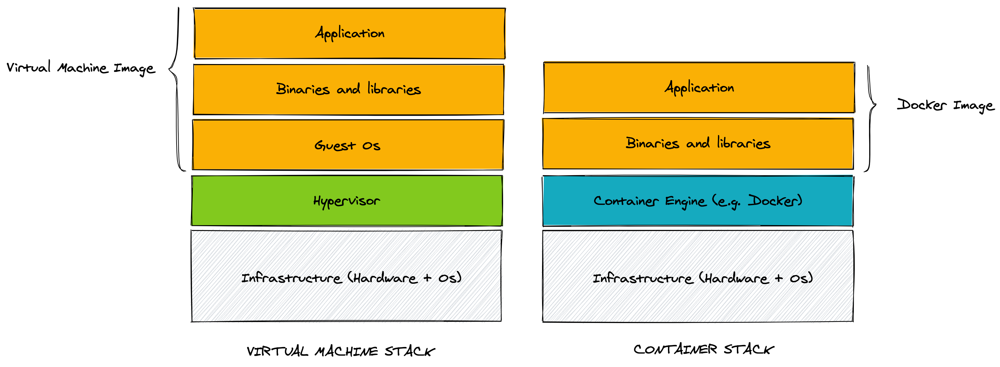
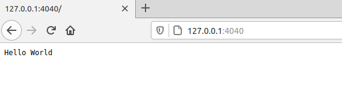

In this article, we are going to learn how to use Docker and Docker Compose for Node.js development. We will discuss the main benefits of this approach and explore some interesting examples. While doing that we will also learn what Docker is and why you should consider it, especially if you are developing multiple projects or if you are working in a team.

## What is a Docker container in simple terms?

To explain what a Docker container is, let's just start by imagining a virtual machine or a virtual server provisioned to run a specific program.

Virtual machines are great because they allow you to run some useful software in an isolated way and they are easy to distribute. You can create an image and run it in different environments. You can even run it in your own desktop machine or share it with your own colleagues. It's a consistent medium to develop and deploy software.

In many ways, Docker containers, are very similar to virtual machines. Docker containers are another way to package (or "containerise") software and run it across different environments.

But there's a fundamental difference with virtual machines. With Docker containers, you don't have the overhead of having to include an entire operating system as part of your image, but only the basic dependencies needed to run some programs.



From the image above you can see that the **Container Engine** runs on top of the operative system and that you don't have to include a guest operative system into your container images. For this reason, containers are much more lightweight than traditional virtual machines, while still providing the benefits of isolation and portability.

But how can we create a new Docker image?

This is generally done by using a special configuration file called `Dockerfile`. Let's not indulge with more theory and let's see an example instead!

Before getting started let's make sure that you have Docker installed in your machine. You can get docker for most platform using the installers available on the [official Docker website](https://docs.docker.com/get-docker/).

Ok, if you are ready, let's create our first `Dockerfile`:

```bash
touch Dockerfile
```

What do we want to put into our Dockerfile? Let's keep things simple for now and let's say that we want to create a container that just run `npm`. To achieve this, this is what we can write into our `Dockerfile`:

```dockerfile
FROM debian:buster
RUN apt-get update && apt-get install nodejs npm -y
CMD ['npm']
```

Ok, let's stop for a second... there's a lot to unpack here!

The first thing that we can see is that a `Dockerfile` is a file with a specific syntax. It is somewhat similar to a Bash script, but there's also something different about it...

The order of lines is important and every line starts with a keyword that defines the type of instruction: in our example, `FROM`, `RUN` and `CMD`.

- `FROM` is generally the first line of any `Dockerfile` and it is used to define which _base image_ do we want to extend. A base image provides a sort of a starting point that can make our life easier. For instance, here by specifying `debian:buster`, we are inheriting all the binaries and libraries that can be found in the _Buster_ version of _Debian_. This includes the package manager `apt` that we can use to install additional software.
- `RUN` is used to run some scripting. This is generally done to install additional software, create configuration files, generate keys, download remote resources, etc. You can see `RUN` instructions as provisioning steps, in other words, instructions you need to run to configure your image. It is quite common to have multiple `RUN` instructions in a `Dockerfile`.
- `CMD` generally appears only once per `Dockerfile` and it indicates which command should be executed when the container runs. In our case, we are using it to specify that we want `npm` to be executed.

There are other commands like `ENV` (define environment variables) and `COPY` (copy a file from your system into the image), but providing a comprehensive guide on how to write a `Dockerfile` goes beyond the scope of this article. If you want to find out more, check out the [official `Dockerfile` reference](https://docs.docker.com/engine/reference/builder/).

Ok, now that we have defined our `Dockerfile`, how do we build a container image?

That's easy, we just need to execute `docker build .` (where `.` means "look for a `Dockerfile` in the current folder). We can also give a name to our image by using tags, so the final command we want to execute is actually going to look like this:

```bash
docker build -t demo-docker/npmdemo .
```

With this command we are "tagging" our image with the name `demo-docker/npmdemo`. We can use this name later to run our container.

So ok, let's run the container then!

```bash
docker run demo-docker/npmdemo
```

If everything went as expected we should see the following output:

```text
Usage: npm <command>

where <command> is one of:
    access, adduser, audit, bin, bugs, c, cache, ci, cit,
    clean-install, clean-install-test, completion, config,
    create, ddp, dedupe, deprecate, dist-tag, docs, doctor,
    edit, explore, fund, get, help, help-search, hook, i, init,
    install, install-ci-test, install-test, it, link, list, ln,
    login, logout, ls, org, outdated, owner, pack, ping, prefix,
    profile, prune, publish, rb, rebuild, repo, restart, root,
    run, run-script, s, se, search, set, shrinkwrap, star,
    stars, start, stop, t, team, test, token, tst, un,
    uninstall, unpublish, unstar, up, update, v, version, view,
    whoami

npm <command> -h  quick help on <command>
npm -l            display full usage info
npm help <term>   search for help on <term>
npm help npm      involved overview

...
```

After showing this output, the container is stopped (simply because `npm` exits after showing the help message) and we are back to our prompt.

Remember that we specified in our `CMD` instruction that we just wanted to run `npm` at container start? This is why we are seeing the `npm` help message when we start the container. What if we want to run the container again but this time we want to run a different command? Can we override the default command? We can easily do that! For instance, we can run the following:

```bash
docker run demo-docker/npmdemo npm --version
```

As you might expect, this is going to print something like this:

```text
6.14.11
```

I know this is not super useful just yet! But hold on for few other minutes so we can discuss why you might want to use Docker in your team. After that, we will actually go building a Docker image for a Node.js HTTP server! I promise that will be interesting :)

## Why Docker and Docker Compose can help you and your team

Any active project will be constantly updated with new features, bug fixes or security patches. This is true for our project as well for the dependencies of our project. Of course, it is desirable to keep the dependencies of our project as much up to date as possible. But, inevitably, different projects might end up using different versions of the same dependency.

Keep in mind that, when we talk about dependencies, we don't mean only libraries but also other systems the project relies on, like a database. Let's take for example MySQL. In 2021 it is common to see project using **MySQL 5.6, MySQL 5.7** or **MySQL 8**.

Now, if we are working on multiple projects that require different versions of MySQL, how can we manage different versions of MySQL in our development machines? Is it always possible to switch from one version to another without messing up our configuration or corrupting the data?

With Docker you can avoid to spend hours to find a solution to this problem and run your entire stack on containers. Different projects can run locally by spinning up a different MySQL container and since every container is isolated, you won't have any issue when switching from one project to another: you won't accidentally corrupt MySQL configuration or its data.

So, the idea is to use Docker to manage every single "process" that is needed to run your application. Every process will run in its own container. For instance, in a regular web application, you might have a container for the web server process and a container for the database.

To manage and integrate many containers together, Docker offers a utility called Docker Compose. Docker Compose looks for a file called `docker-compose.yml` where you can define all the necessary configuration and containers you want to run for your project.

If you work in a team, you don't have to agree in advance on every single configuration detail with your teammates or make sure that everyone has exactly the same setup. In fact, with Docker compose, you can just share the `docker-compose.yml` configuration as part of your project and Docker will take care to spin up the same containers in every machine.

At any point in time, if someone on the team decides to update a dependency or introduce a new dependency, they will do so by updating the `docker-compose.yml` and everyone else will easily be able to get the latest changes.

Even if you have a new joiner in the team, they don't have to understand and install all the necessary dependencies one by one, they can simply install Docker rely on the latest version of `docker-compose.yml` to run the project on their development machine.

This is one of the main advantages that you can get by using Docker and Docker Compose for development.

Let's now see an example of a `docker-compose.yml`:

```yaml
version: '3'

################################################################################
# SERVICES
################################################################################
services:
  # ------------------------------------------------------------
  # MySQL Database
  # ------------------------------------------------------------
  mysqlserver:
    container_name: myproject_mysql
    image: mysql:5.7

    environment:
      MYSQL_ROOT_PASSWORD: 'docker'
      MYSQL_USER: 'local'
      MYSQL_PASSWORD: 'local'

    volumes:
      # ---- Format: ----
      # HOST-DIRECTORY : DOCKER-DIRECTORY
      - ${MYSQL_BACKUP_FOLDER}:/backup/

    networks:
      app_net:
        ipv4_address: ${IP_MYSQL_SERVER}

################################################################################
# NETWORK
################################################################################
networks:
  app_net:
    driver: bridge
    ipam:
      driver: default
      config:
        - subnet: ${IP_SUBNET}
```

What is inside this this file?

- `services` : this is the list of the containers (and their settings) that we want to run in our project
- `mysqlserver` : the name of the service. This name is used when you use `docker-compose` command and you want to refer to this specific service (container).
- `container_name` : overrides the default alias of the container. It's a good practice to use something like `<name of the project>_<name of the service>` to avoid conflict with other projects.
- `image` : the name of the Docker image that we want to use (as defined in the Docker registry).
- `environment` : environment variables used inside the container.
- `volumes` : shared folder between your computer and the container. You can crate a mapping of your destination folder even if doesn't exist. In our example we map our backup folder with `/backup` folder inside the container. Very useful if we want to crate a standard script for restoring the data into the database (e.g. standard seed data shared across devs).
- `networks` : add specific ipv4 IP to our container. Setting up a specific IP for your container (service) is very useful when you have to work with different projects or you want to create local DNS aliases for your project.
- `networks → app_net → driver: bridge` this is a default configuration to allow the container to connect to the internet through the host system. The name `app_net` is a the name we want to give to the Docker network, so you can name it wathever makes sense to you. Refer to the [official documentation on custom networks](https://docs.docker.com/compose/networking/#specify-custom-networks) for more information.

Now let's see our `.env` file that we are going to use to store the enviornment variables needed for this project:

```bash
################################################################################
### MySQL Settings
################################################################################
MYSQL_BACKUP_FOLDER=/home/user/backup_db/project_x/

################################################################################
### IP Settings
################################################################################
IP_SUBNET=172.16.250.0/24
IP_LOCAL_COMPUTER=172.16.250.1
IP_MYSQL_SERVER=172.16.250.11
```

It is not always necessary to use an `.env` file, especially in simple examples like this one. It is a good practice to use one, though. The main advantage is when you have to share the `docker-compose.yml` and the `.env` with the team.

Generally the `.env` file is not committed to the repository. The idea is to use it to provide "user specific" configuration, so every member of the team can choose your own range of IPs or reference their own work folders.

Let's see an example. If we add in `docker-compose` a service for Node.js we can add some "link" to other services.
(official docker documentation: https://docs.docker.com/compose/compose-file/compose-file-v3/#extra_hosts)

```yaml
# ...

# ------------------------------------------------------------
# Node.js Server
# ------------------------------------------------------------
nodejs:
  # ...

  extra_hosts:
    - mysql-server-service:${IP_MYSQL_SERVER}
# ...
```

In `extra_hosts` we can add all entries that are stored in our `/etc/hosts` file so we can create "custom domain" via local configuration without have a real domain.

In this specific case in our Node.js app we can refer to mysql server not via IP but via "mysql-server-service" name.

Let's go back to our docker-compose file. At this point we can run `docker-compose` to start all the docker services specified in our project:

```bash
docker-compose up -d
```

Note that the `-d` option will start all the services in background.

After a few seconds, all our services should be running. So let's see, for example, how we can access the MySQL shell and run a query:

```bash
docker-compose exec mysqlserver /bin/bash
root@2f88599b3b1f:/# mysql -u root -pdocker (...enter root password)
mysql> SHOW DATABASES;
```

First of all: we need to "open" a bash shell inside the container so we can run any command. We can do that with: `docker-compose exec mysqlserver /bin/bash`.

These are the arguments of this `docker-compose` command:

- `exec` : Docker searches for a running container (with the name `mysqlserver`) to run a given command. If you don't run `docker-compose up -d` before, this command will fail.
- `/bin/bash` : is the name of the command we want to run inside the container.

Once we are "inside" the container we can do anything we want. In this case we want open a mysql terminal, so we run `mysql -u root -pdocker`.

Note that the root password is defined by environment variable `MYSQL_ROOT_PASSWORD`.

## Create and configure a Node.js project with Docker

Based on the complexity of the project we might decide to use Docker directly one or more containers or to rely on Docker Compose to orchestrate multiple containers.

Let's take a look at this simple "Hello World" web server (file `app.js`).

```javascript
const http = require('http')

const hostname = '0.0.0.0'
const port = 4040

const server = http.createServer((req, res) => {
  res.statusCode = 200
  res.setHeader('Content-Type', 'text/plain')
  res.end('Hello World')
})

server.listen(port, hostname, () => {
  console.log(`Server running at http://${hostname}:${port}/`)
})
```

Nothing particularly complicated here, we are simply creating a web server that responds to every request with an "Hello World!".

But pay special attention to `hostname`! With docker you can have connectivity problems if you use `"localhost"` or `"127.0.0.1"`, because it refers to the docker container and not to your local machine, therefore the container will only listen for connections from inside the container itself. It's better to use use `"0.0.0.0"` or directly the ip associated to the container so that we can issue requests from our local machine or from other containers.

### Work with Docker directly (no configuration file)

To start this application with Docker, we don't necessarily need to create a `Dockerfile` or a `docker-compose.yml`. We can simply run (in the same folder of `app.js`) the following command:

```bash
docker run \
  --rm \
  -p "4040:4040" \
  -v ${PWD}:/home/node/project \
  node:14 \
  node /home/node/project/app.js
```

At this point we should be able to connect to our web server using a browser by simply visiting `http://127.0.01:4040`.



Let's discuss in more detail what's happening when we run the command above:

- `--rm` means "destroy the container once it is stopped".
- `-p` maps a port of your pc to a port in the container (in this case we are saying map the local port `4040` to the port `4040` inside the container).
- `-v` stands for "volume" and it is used to map the folder (`$PWD`) in the development machine to the `/home/node/project` folder inside the container.
- `node:14` is the name and version of the docker image we want to use (this comes from the [official Docker Registry](https://hub.docker.com/))
- `node /home/node/project/app.js` is the command we want to run once the container starts. We are simply executing `node` and running our app file.

Note that `/home/node/project/app.js` refers to the mapping of the local folder to volume in the container. Remember that Docker runs isolated processes, so by default they don't have access to our filesystem and we can only share files by explicitly defining and attaching volumes to running containers.

### Work with docker-compose.yml and the docker-compose command

Let's now look at doing the same thing but with a different approach. By using an `.env` file, a `docker-compose.yml` file and `docker-compose`, we can define all the necessary settings there so we can keep our command line as lean as possible.

This is how we can define our `docker-compose.yml`:

```yaml
version: '3'
services:
  nodejs:
    container_name: ${COMPOSE_PROJECT_NAME}_${NODEJS_SERVER_NAME}
    image: ${NODEJS_CONTAINER_IMAGE}
    user: ${NODEJS_USER}
    command: ${NODEJS_COMMAND}
    ports:
      - '4040:4040'
    environment:
      NODE_ENV: ${NODEJS_ENV}
    volumes:
      - ${PWD}:/home/node/project
    working_dir: /home/node/project
    networks:
      app_net:
        ipv4_address: ${IP_NODE_SERVER}
networks:
  app_net:
    driver: bridge
    ipam:
      driver: default
      config:
        - subnet: ${IP_SUBNET}
```

And this is how we can define our `.env` file:

```bash
COMPOSE_PROJECT_NAME=nodetest
NODEJS_CONTAINER_IMAGE=node:14
NODEJS_SERVER_NAME=nodejs
NODEJS_USER=node
NODEJS_ENV=development
NODEJS_COMMAND=node app.js
IP_SUBNET=172.16.250.0/24
IP_LOCAL_COMPUTER=172.16.250.1
IP_NODE_SERVER=172.16.250.10
```

At this point we just need to run `docker-compose up` and we should have the same result as the command described before.

If you want to run in background mode (so you can close the terminal) just add `-d` to the command like `docker-compose up -d`.

If you want to change something like node version, just edit the `.env` file in the same folder and done!

Once you are finished working on the project and you want to stop the containers, you can simply run:

```bash
docker-compose down
```

## Pros and cons of using Docker with Node.js

It might seem that Docker is like magic for your project but, as with many things, "all that glitters is not gold". Of course, Docker is great, but it can have its fair share of unexpected "surprises" that can be tedious to resolve.

Let's conclude this article, by discussing some of the main pros and cons of using Docker for Node.js development.

### PROS

- You can manage multiple version of Node.js without having to install all of them or needing complicated setup to be able to switch version on demand.
- You can use different version of Node.js at the same time. Imagine you have a microservice-oriented architecture and 2 different services need to use 2 different versions of Node.js!
- It is easier to share a consistent setup with the members of your team. Docker becomes the only shared dependency that needs to be pre-installed.

### CONS

- For small projects running only one monolithic service setting up Docker and Docker Compose can be a bit of over-engineering.
- With more advanced projects, you might need to setup some bash scripts to run some Docker command (because they might be long and difficult to remember).
- For Mac OS and Windows you can have some setup problems and degraded performances because Docker is not running natively in these platforms.

That's all! Hopefully you found this article interesting and you will decide to give Docker a shot for your Node.js development.

You can check out the code examples in the following repository: https://github.com/giuseppemorelli/docker-node-example. If you liked this article, please consider giving it a star, everyone needs some vanity metrics, after all! :)

:::tip[Take Your Node.js Skills Further]
Whether you're using Docker or not, understanding Node.js patterns and best practices is essential. **Node.js Design Patterns** covers async patterns, streams, scalable architectures, and more.

[Get a FREE chapter →](/#free-chapter)
:::

## About the author

Giuseppe Morelli is the guest author of this post. This is Giuseppe's bio.

Since I was a baby I came to love technology and programming. Today I am a remote worker for Italian and European companies. I like to work with Agile and Time-Material practices.
I have been a PHP Developer by trade since 2006, and I am particularly experienced with e-commerce development. Every day I try to learn something new by being a part of the open-source community. In 2020 I've started to study Node.js by reading Mario and Luciano's book :)

If you want to connect with me, check out [my personal website](https://giuseppemorelli.net) or my [Twitter account](https://twitter.com/giuseppemorelli).
